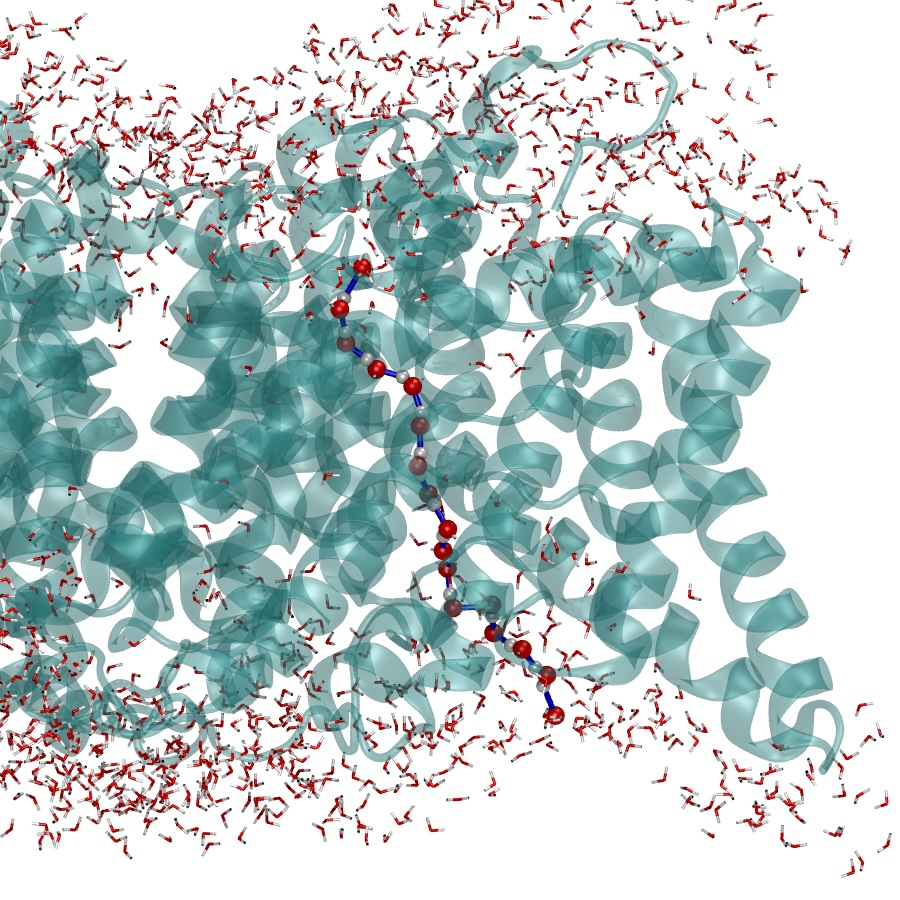

# Water Wire Finder

<p align="center">
  
</p>

The **Water Wire Finder** VMD plugin offers a streamlined tool for identifying and visualizing hydrogen-bonding networks between atom groups. Using advanced graph-based algorithms, it maps hydrogen bond networks in water molecules and employs shortest path algorithms to determine connectivity between specified atom groups.

## Applications

This toolkit serves multiple research purposes, including:
- Assessing solvent accessibility of bound ligands
- Identifying water permeation pathways through membrane proteins
- Determining optimal proton transition pathways

## Download and Installation (Linux)

1. Download codes to your preferred location
2. Add these lines to your .vmdrc file (typically located at ~/.vmdrc):
   ```
   lappend auto_path /WHERE/YOU/EXTRACTED/THE/CODE/waterwire
   vmd_install_extension waterwire waterwire "Analysis/waterwire"
   ```
3. **Note**: Your .vmdrc file must contain the line: `menu main on` for VMD to function correctly
4. Launch VMD and verify installation by clicking Extensions > Analysis > waterwire

## Using the Graphical Interface

### Input Molecule
Select the target molecule and frame range:
- **Mol ID**: Choose the molecule to analyze
- **First/Last Frame**: Set the beginning and end frames
- **Step**: Define the frame interval for analysis

### Atom Selections
- **Atom Group 1** and **Atom Group 2**: Define the two endpoints of the water wire
- **Water Selection Restriction**: Optionally limit the search to specific regions of interest

### Search Parameters
- **Search Type**: Choose between minimum number of bonds or shortest physical distance
- **Hbond Cutoff**: Configure hydrogen bond criteria:
  - **Distance**: Maximum separation between donor and acceptor atoms
  - **Angle**: Maximum angular deviation from 180° for donor-hydrogen-acceptor

### Analysis
Click **Run Now!** to begin water wire exploration across selected frames. Results appear in a list below, allowing you to visualize water wires by selecting individual frames.
